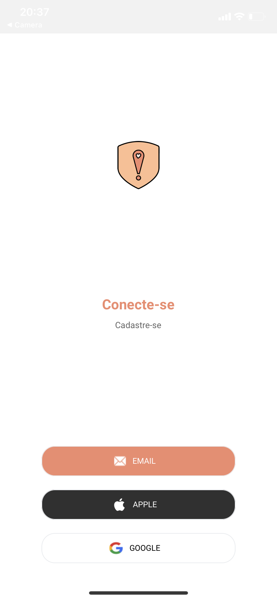
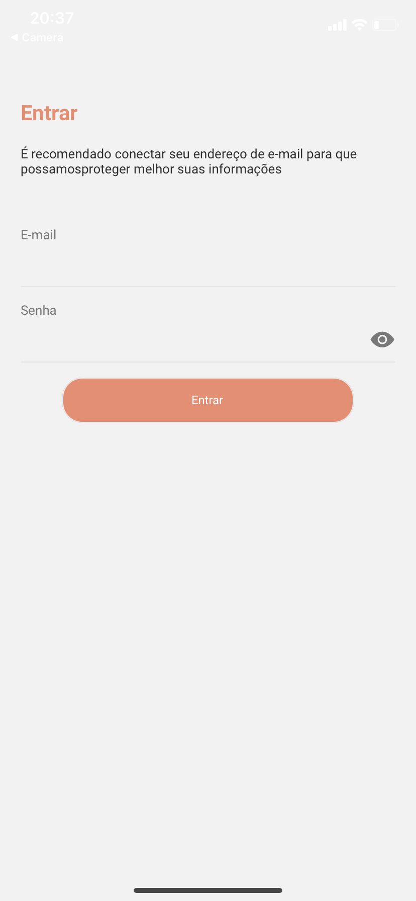
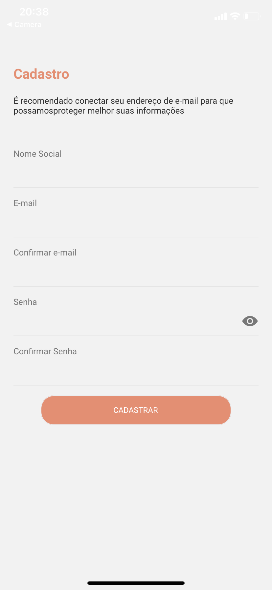
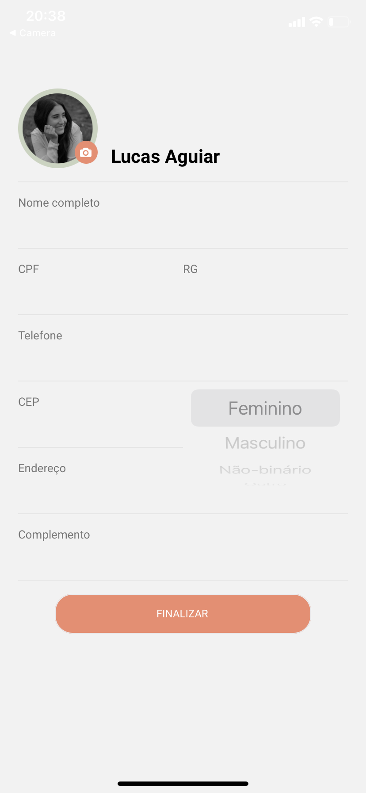
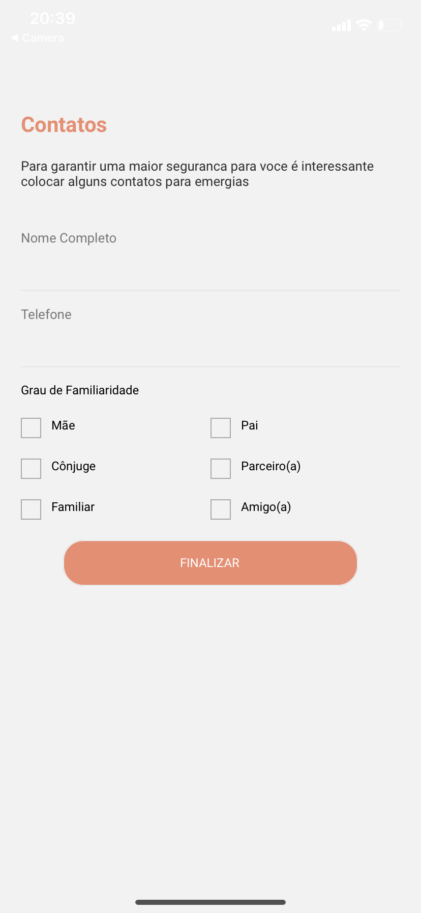
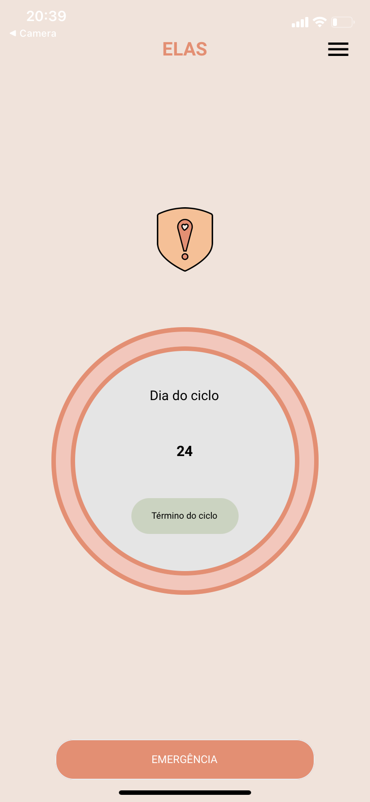
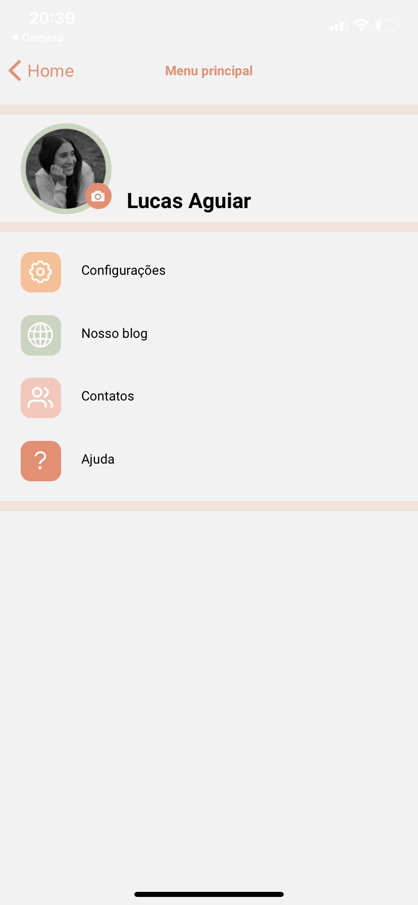
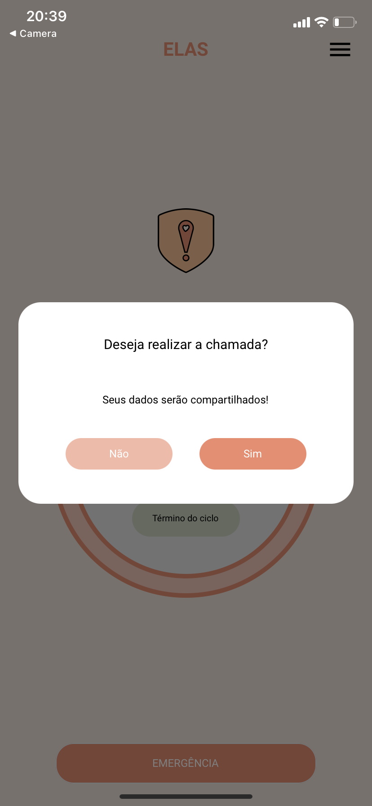

  
   
  <h1>ELAS</h1>
  <h3>
  Planejamos criar um aplicativo de alerta de abuso sexual com mapeamento e geolocalização para notificar imediatamente a polícia de ataques. Mas para isso ainda precisamos fazer diversos preparativos como: prototipar o aplicativo, estabelecer uma estratégia de marketing e divulgação, buscar parcerias(prefeitura, delegacia da mulher, mídias locais e empresas com a mesma proposta), para em fim fazer o lançamento do beta.
  </h3>
   

  <h4>O aplicativo em modo geral pode ser usado por todo o tipos de pessoas, em especial mulheres, transexuais e travestis, que sofrem, já sofreram ou tenham medo de sofrer abusos sexuais.</h4>

  <a href="#rocket-technologies">Technologies</a>

  
   
  
  
  
  
  
  

---
### Nome dos participantes
- Lucas Aguiar
- Lucas Borges
- Matheus Taurino
- Patricia Regina
## :rocket: Technologies
- [ReactJS](https://reactjs.org/)
- [Typescript](https://www.typescriptlang.org)
- [styled-components](https://www.styled-components.com/)
---
Made with ♥ by Lucas Aguiar :wave: [Get in touch!](https://www.linkedin.com/in/lucasaguiiar)
